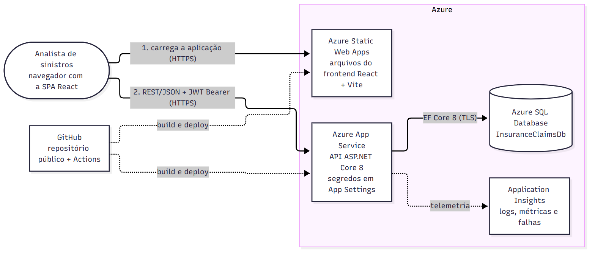

# Insurance Claims

Gestão de sinistros para uma seguradora: cadastro, consulta, edição e exclusão de sinistros, com autenticação,
filtros, paginação, tipos de sinistro parametrizados, validação de CPF/CNPJ e dashboard gerencial.

Projeto desenvolvido para um desafio técnico. Os requisitos atendidos: operações de leitura, cadastro, edição e
exclusão; SOLID e Clean Code; React, .NET, banco relacional e Azure; desenho de solução com componentes da Azure.

## Stack

| Camada | Tecnologia |
| --- | --- |
| Frontend | React 19, Vite 8, Mantine 9, Recharts |
| Backend | ASP.NET Core 8 Web API, Entity Framework Core 8, JWT Bearer, Swagger |
| Banco de dados | SQL Server (local) e Azure SQL Database (nuvem) |
| Nuvem | Azure App Service, Static Web Apps, Azure SQL, Application Insights, GitHub Actions |

## Desenho de solução



O documento completo, com a arquitetura na Azure, as camadas da aplicação e o fluxo de uma operação, está em
[docs/desenho-solucao.md](docs/desenho-solucao.md).

## Funcionalidades

- Login com e-mail e senha; token JWT de curta duração; alteração de senha com política de complexidade.
- Sinistros: listagem paginada com busca e filtros (status, tipo, período, faixa de valor), cadastro, edição,
  exclusão lógica (soft delete) e número único entre os sinistros ativos.
- Tipos de sinistro em tabela de referência, carregados pela API.
- Validação de CPF e CNPJ com dígitos verificadores, no formulário e no backend.
- Dashboard com totais, distribuição por status, sinistros por tipo, evolução mensal e últimos registros,
  agregados no banco de dados.
- Erros padronizados em ProblemDetails; tema claro/escuro; layout responsivo.

## Estrutura do repositório

```
backend/    API ASP.NET Core 8 em quatro projetos: Domain, Application, Infrastructure e Api
frontend/   SPA React com Vite e Mantine
docs/       Desenho de solução, imagens e guia de publicação na Azure
.github/    Workflows do GitHub Actions (build e deploy)
```

Cada parte tem seu próprio README com detalhes: [backend](backend/README.md) e [frontend](frontend/README.md).

## Como executar localmente

Pré-requisitos: SDK .NET 8, Node.js 22 (ou 20.19+), SQL Server (Express ou LocalDB) e Git.

### 1. Banco de dados

A conexão padrão usa `localhost\SQLEXPRESS` com autenticação do Windows e cria o banco `InsuranceClaimsDb`.
Para outra instância, defina `ConnectionStrings__InsuranceClaims` antes dos comandos abaixo.

### 2. Backend

No PowerShell, na pasta `backend`:

```powershell
$env:Jwt__SecretKey = 'troque-por-uma-chave-forte-com-pelo-menos-32-caracteres'
$env:AuthSeed__Name = 'Administrador'
$env:AuthSeed__Email = 'usuario@exemplo.com'
$env:AuthSeed__Password = 'Troque-Esta-Senha-1!'

dotnet restore
dotnet tool restore
dotnet ef database update --project InsuranceClaims.Infrastructure --startup-project InsuranceClaims.Api
dotnet run --project InsuranceClaims.Api --launch-profile http
```

A API sobe em `http://localhost:5169`, com Swagger em `/swagger`. As variáveis `AuthSeed__*` criam o primeiro
usuário na inicialização, se o e-mail ainda não existir; os valores acima são apenas exemplo.

### 3. Frontend

Em outro terminal, na pasta `frontend`:

```powershell
npm install
npm run dev
```

Abra `http://localhost:5173` e entre com o e-mail e a senha definidos em `AuthSeed__*`.

### Verificação automatizada

Com a API em execução, o script abaixo exercita autenticação, CRUD, validações, duplicidade e dashboard:

```powershell
powershell -ExecutionPolicy Bypass -File backend/scripts/SmokeTest.ps1 -Email 'usuario@exemplo.com' -Password 'Troque-Esta-Senha-1!'
```

## Publicação na Azure

Os workflows em `.github/workflows` fazem build a cada push em `main` e publicam a API no App Service e o
frontend no Static Web Apps quando as variáveis de repositório abaixo existem:

| Tipo | Nome | Conteúdo |
| --- | --- | --- |
| Segredo | `AZURE_WEBAPP_PUBLISH_PROFILE` | Perfil de publicação do App Service |
| Segredo | `AZURE_STATIC_WEB_APPS_API_TOKEN` | Token de implantação do Static Web Apps |
| Variável | `AZURE_WEBAPP_NAME` | Nome do App Service |
| Variável | `VITE_API_BASE_URL` | URL pública da API |

Nenhum segredo fica no repositório: connection string, chave JWT e usuário inicial são configurados no App Service.
O passo a passo da criação dos recursos está em [docs/publicacao-azure.md](docs/publicacao-azure.md).
As URLs do ambiente publicado ficam na descrição do repositório.

## Decisões de arquitetura

- Quatro camadas no backend com dependências apontando para o domínio; as interfaces ficam na camada
  Application e são implementadas na Infrastructure, registradas por injeção de dependência na Api.
- Regras de negócio e validações no backend, que é a fonte de verdade; o frontend valida para dar retorno imediato.
- Exclusão lógica para preservar histórico, com índice único filtrado que permite reutilizar o número de um
  sinistro excluído.
- Senhas com PBKDF2-SHA256 e salt; JWT assinado com chave simétrica fornecida por configuração.
- Migrations aplicadas por comando explícito, não na inicialização da API.

Os detalhes e as limitações de cada parte estão nos READMEs do [backend](backend/README.md) e do
[frontend](frontend/README.md).

## Próximos passos

- Migração para .NET 10 LTS: o .NET 8 sai de suporte em 10/11/2026. O plano, com passos, validação e
  plano de retorno, está em [docs/migracao-dotnet10.md](docs/migracao-dotnet10.md).
- Perfis de acesso: um perfil aprovador, único que pode aprovar ou rejeitar sinistros, e um perfil operador
  para as demais operações, com a regra aplicada no backend e refletida na interface.
- Segredos no Azure Key Vault, lidos pelo App Service com Managed Identity, no lugar das App Settings.
- Testes automatizados de unidade e integração.
- Refresh token ou autenticação corporativa com Microsoft Entra ID.
- Gestão de usuários e recuperação de senha.
