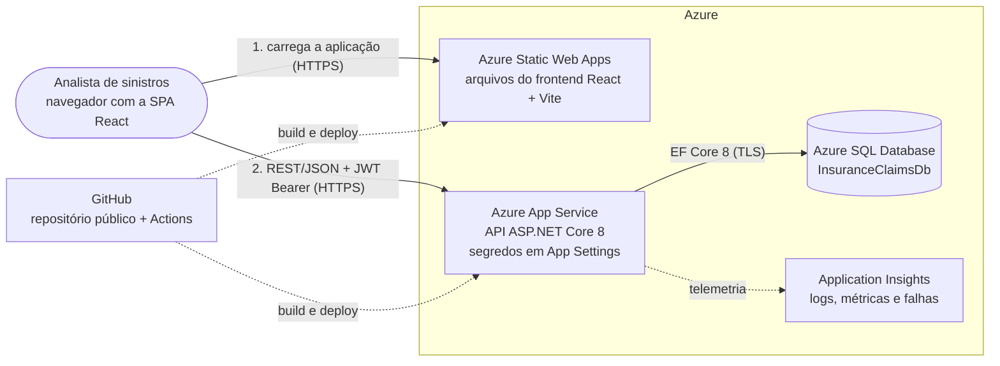
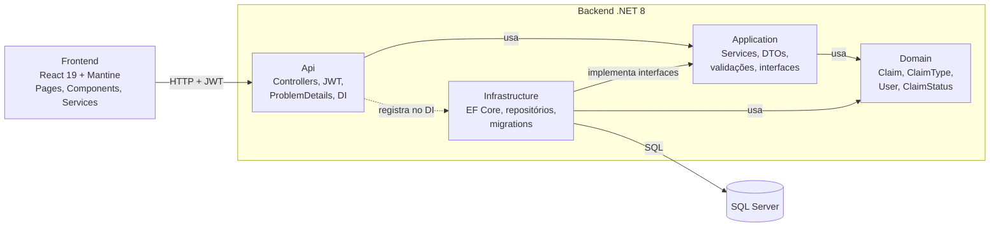
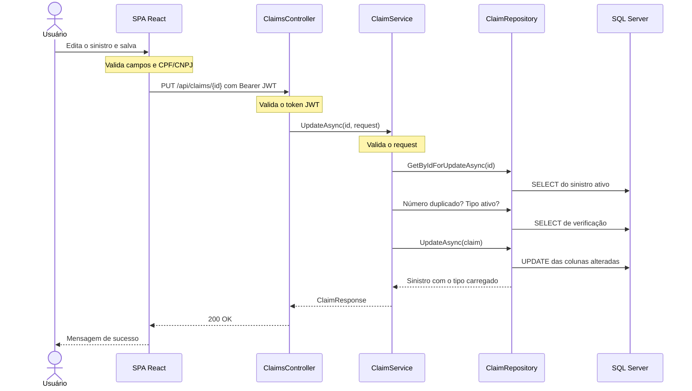

# Desenho de solução — Insurance Claims

Aplicação de gestão de sinistros para uma seguradora: cadastro, consulta, edição e exclusão de sinistros,
com autenticação, filtros, paginação e dashboard gerencial.

Este documento apresenta três visões: a arquitetura na Azure, as camadas da aplicação e o fluxo de uma operação.

## 1. Arquitetura na Azure

> A aplicação está publicada nesta arquitetura: configuração por variáveis de ambiente, nenhum segredo
> no repositório, banco compatível com Azure SQL e workflows de publicação no repositório.
> O passo a passo da publicação está em [publicacao-azure.md](publicacao-azure.md); as URLs do ambiente
> publicado ficam na descrição do repositório. A aplicação também roda localmente, com SQL Server Express.

| Componente | Papel na solução | Motivo da escolha |
| --- | --- | --- |
| Azure Static Web Apps | Entrega os arquivos estáticos do frontend | O frontend é uma SPA; não precisa de servidor próprio |
| Azure App Service | Hospeda a API ASP.NET Core 8; connection string e chave JWT ficam em App Settings | Serviço gerenciado para .NET; a configuração fica fora do código e do repositório |
| Azure SQL Database | Banco de dados relacional | Compatível com o SQL Server usado localmente; as mesmas migrations se aplicam |
| Application Insights | Logs, métricas e rastreamento de falhas | Diagnóstico em produção sem acesso ao servidor |
| GitHub Actions | Build e publicação | Os workflows em `.github/workflows` fazem build e deploy a cada push em `main` |

Evolução prevista: mover os segredos das App Settings para o Azure Key Vault, lido pelo App Service com
Managed Identity. O procedimento está descrito como etapa opcional em [publicacao-azure.md](publicacao-azure.md).

O navegador fala com dois destinos: baixa a aplicação do Static Web Apps e depois chama a API diretamente.
Por isso a API libera, por CORS, somente a origem do frontend, configurada em `Cors:AllowedOrigins`.

## 2. Camadas da aplicação

| Camada | Responsabilidade | Depende de |
| --- | --- | --- |
| Domain | Entidades e enum de status | Nada |
| Application | Regras de negócio, validações, DTOs e contratos (interfaces) | Domain |
| Infrastructure | Persistência com EF Core e implementação dos repositórios | Application e Domain |
| Api | Entrada HTTP, autenticação, tratamento de erros e composição (DI) | Application e Infrastructure |

As dependências apontam para dentro. A camada Application define as interfaces de que precisa
(`IClaimRepository`, `IPasswordHasher`, `IJwtTokenGenerator`) e não conhece EF Core nem ASP.NET.
Trocar o banco ou a forma de gerar o token exige uma nova implementação, sem alterar as regras de negócio.

## 3. Fluxo de uma operação: edição de sinistro

A validação acontece duas vezes de propósito: no frontend, para dar retorno imediato ao usuário, e no backend,
que é a fonte de verdade. Erros voltam no formato ProblemDetails: 400 para dados inválidos, 401 sem token válido,
404 para sinistro inexistente e 409 para número duplicado.

## Imagens

Versões em PNG dos três diagramas, para uso em slides:

- [Arquitetura na Azure](img/arquitetura-azure.png)
- [Camadas da aplicação](img/camadas.png)
- [Fluxo de edição de sinistro](img/fluxo-edicao.png)
